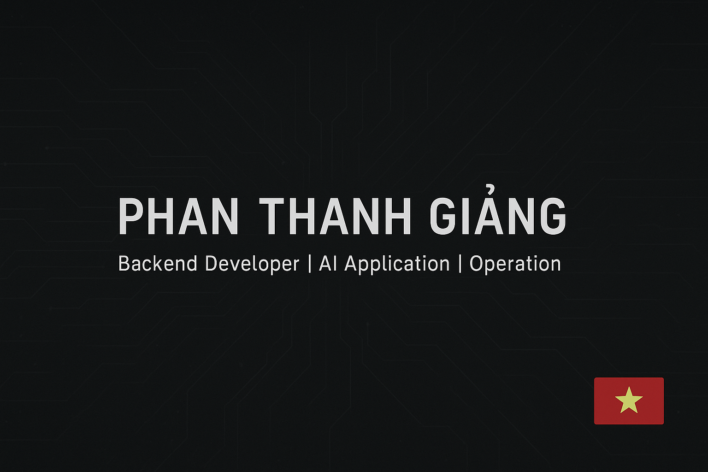

# 👋 Xin chào! Tôi là Giang Phan (Phan Thanh Giảng)

 <!-- Nếu có banner, bạn có thể thay thế URL này -->

## 🚀 Về tôi
- 🎓 **Chuyên ngành**: Khoa học máy tính  
- 🎓 **Trường**: Đại học Cần Thơ (CTU), Việt Nam  
- 💼 **Công việc**: Developer tại VNPT Vĩnh Long  
- 🌍 **Quốc tịch**: Việt Nam  
- 🎉 **Ngày sinh**: 28/08/1997  
- 📫 **Email**: [giangpt@duck.com](mailto:giangpt@duck.com)  
- 🏠 **Quê quán**: Vĩnh Long

## 💻 Kỹ năng chính
- 🛠️ **Backend Developer**  
- 🤖 **AI Application**  
- ⚙️ **Operation**  

## 💡 Ngôn ngữ lập trình
- Python  
- PHP  
- JavaScript  

## 🗄️ Cơ sở dữ liệu
- SQL Server  
- MongoDB  

## 🌐 Các dự án nổi bật
- 🔗 [SVTT - Quản lý sinh viên thực tập](https://svtt.io.vn)  
- 🔗 [GCS - Giải pháp lưu trữ và chia sẻ](https://gcs.id.vn)

## 📱 Kết nối với tôi
- 📘 [Facebook](https://www.facebook.com/giangpt2808)  
- ✈️ [Telegram](https://t.me/giangisnotdev)  
- 🐦 [Twitter](https://www.twitter.com/giangpt2808)  

Cảm ơn bạn đã ghé qua hồ sơ của tôi! 🚀  
